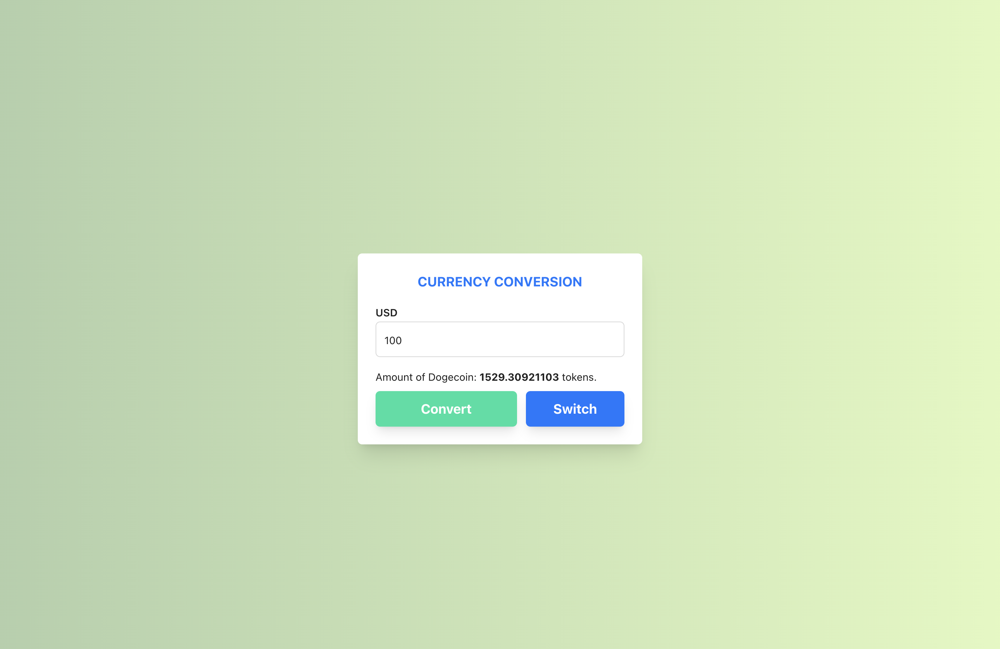

# Round 1: Crypto Input

## 1.  Some screenshots about my application.





## 2.  Explanation about my application

-   My product has a function that allows users to convert dogecoin to USD and vice versa.
-   Regarding the interface, the application includes 1 input field and 2 conversion and swtich buttons. Initially will also be disabled, when the user enters a value in the input field, they will be enabled.
-   Technologies used: `ReactJs`,`Typescript` ,`tailwind`, `scss`
## 3.  Run project
-   Fist install all dependencies (require node version >= 18.0.0)
```
yarn
```
- Run the development server
```
yarn start
```

## 4.  Feedback
With this exercise everything is fine with me. If I have more time, I think I can improve more on the UI/UX part so that I can improve the user experience.
## 5. Screen recoding
[Google drive](https://drive.google.com/file/d/1omTPf18xG20LbDx_78FJDwEOkNjZpmaH/view?usp=sharing)