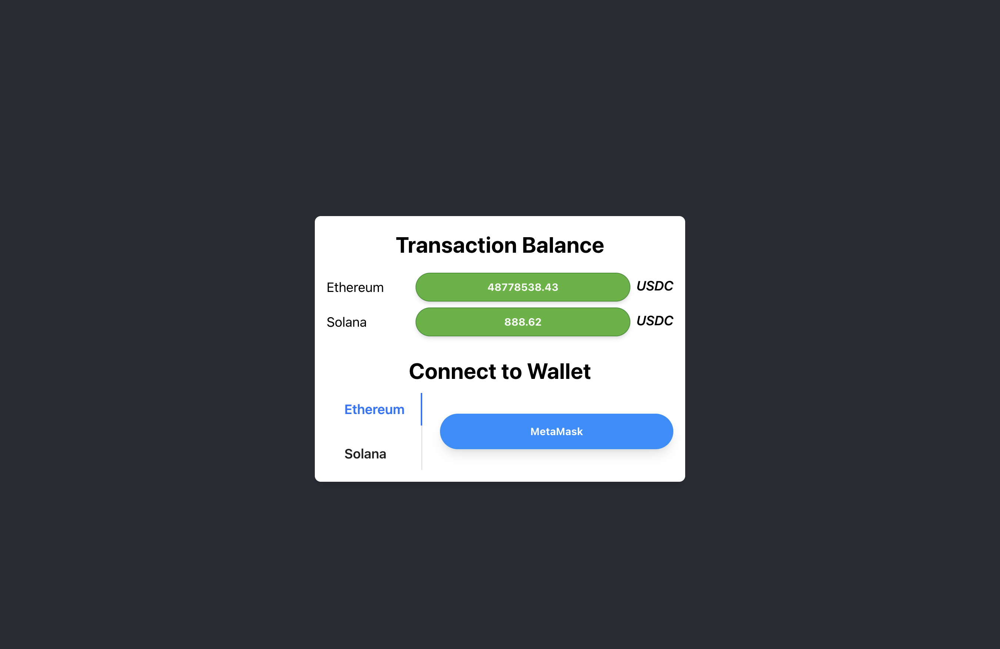
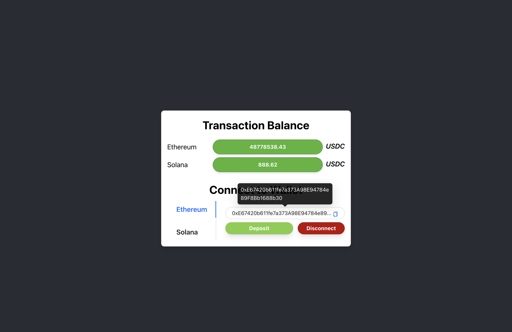
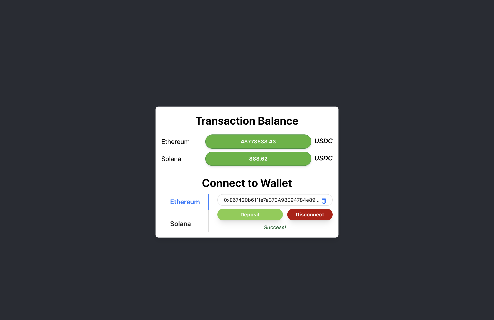
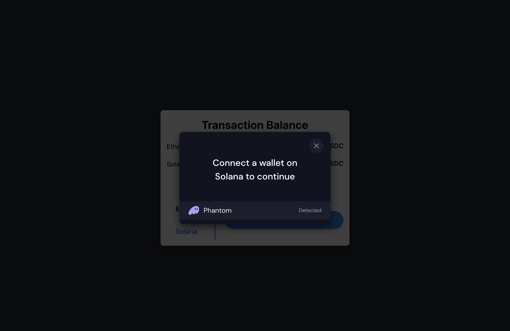
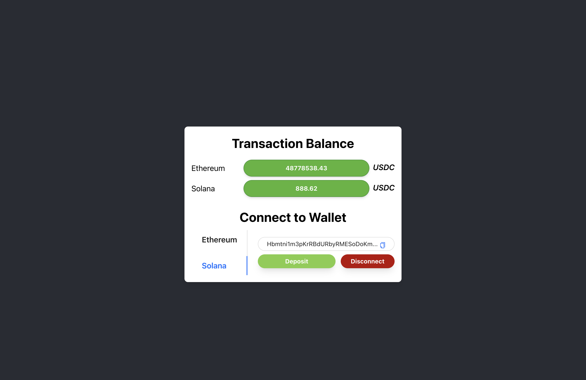

# Round 2: Multichain Wallet Connections

## 1.  Some screenshots about my application.







## 2.  Explanation about my application

-   My app shows the account balance and makes it possible for the user to connect to his wallet (Ethereum or Solana). In addition, users can also disconnect from the wallet or make a deposit to the wallet.
-   In terms of interface, the application consists of two parts, showing the account balance and connecting to the wallet.
-   In the application I use 2 wallets for 2 chains respectively: MetaMask for Ethereum and Phantom for Solana.
## 3. Run project
-   Fist install all dependencies (require node version >= 18.0.0)
```
yarn
```
- Run the development server
```
yarn start
```
- To connect the Wallet, you need to install some extension: [MetaMask](https://chrome.google.com/webstore/detail/metamask/nkbihfbeogaeaoehlefnkodbefgpgknn) and [Phantom](https://chrome.google.com/webstore/detail/phantom/bfnaelmomeimhlpmgjnjophhpkkoljpa)
## 4. Feedback
-   For this test, I think this is an interesting challenge for me. I tried to research the relevant documents before doing it (all in 1 day). I think I was well prepared before I started doing it.
-   Because of the time limit, I think the product is limited, if I have more time, I think I can learn more about the related libraries to improve the product.

## 5. Screen recording
[Google drive](https://drive.google.com/file/d/1e8tB5TC9eXHIqeOp6WoHB_MpBofNp4Hd/view?usp=sharing)